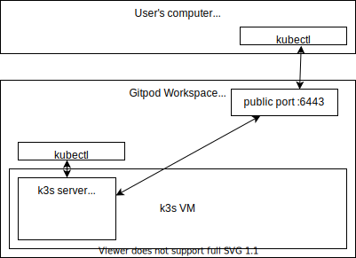

# k3s on Gitpod

[](https://gitpod.io/#https://github.com/fntlnz/gitpod-k3s)

Just click on the button above and you will be in a Gitpod workspace with k3s running.

You can copy the `.gitpod.yml` and the `.gitpod` folder to your own project to also have the k3s environment ready in there.

Here's a diagram of the interactions that also shows how the various components interact with each other.

<center>



</center>

## Usage

At start, the workspace will start a VM in your gitpod workspace and
automatically install k3s on it. Your local environment will be automatically
configured to use that via the `kubectl`


### Connecting via kubectl

When you open your workspace terminal, the `kubectl` is already configured for you
via the `~/.kube/config` file.

### Kubectl from my local terminal


### Connecting via SSH

You can connect to the VM via ssh at any moment. The ssh daemon
is exposed on `127.0.0.1` for the workspace on port `2222`.

- username: root
- password: root

```console
ssh -p 2222 root@127.0.0.1
```

You can use the `.gitpod/ssh.sh` and `.gitpod/scp.sh` scripts if you want to
avoid the extra steps.
